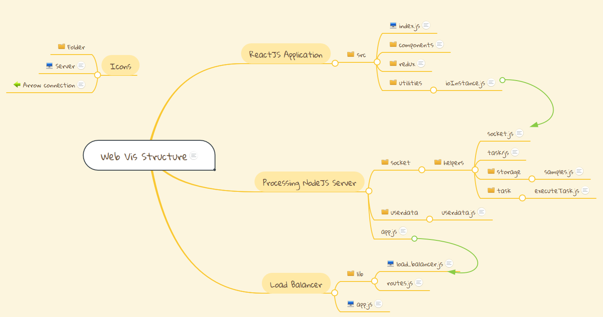

# FCLWebVis: A Flexible Cross-Language Web-based Data Visualization Framework
### Abstract
We present a new web-based, server-client data processing and visualization framework that supports a flexible workflow, enabling the user to customize different data processing and visualization tasks. Our framework also supports server-side applications developed with different languages, allowing visualization researchers to easily make their new techniques available to the target users. We describe the design of the architecture of our framework and the process of adding new user-defined tasks, followed by the demonstration of the proposed framework on a number of data processing and visualization tasks. 

### Getting Started
Please see installation and usage instructions in [Getting Started.pdf](Getting_Started.pdf)

### Project Structure Overview
For a brief description of important folders, scripts, and components, see the flow chart here: https://www.mindmeister.com/1896426823?t=Hu7Heux5bR
Preview:

For more detailed descriptions see [Project_Structure_Overview.pdf](Project_Structure_Overview.pdf)